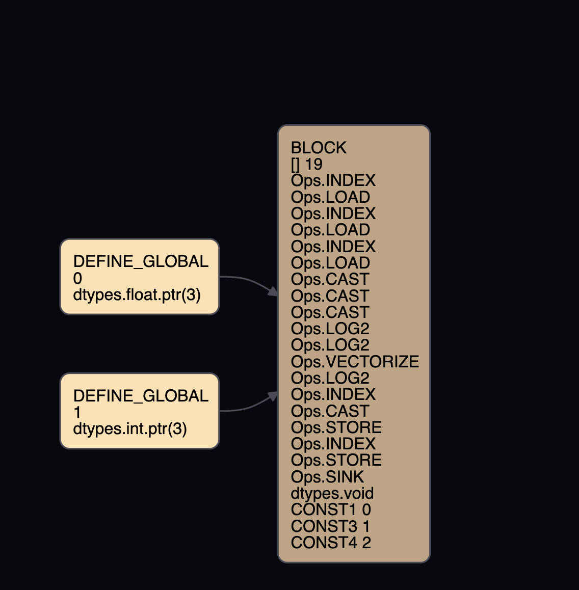

When we call `UOp.broadcast()` this creates a `Ops.VECTORIZE`.

In `rewriter.py`'s `expander` PatternMatcher we have:
```py
(UPat(Ops.VECTORIZE, src=UPat(Ops.DEFINE_ACC, name="acc"), name="v"),
lambda acc,v: acc.replace(dtype=v.dtype, src=(acc.src[0].broadcast(v.dtype.count),)+acc.src[1:]))
```
which says we vectorize all `DEFINE_ACC` Ops.

Where does `Ops.DEFINE_ACC` come from?

In `lowerer.py`'s `lower_reduce_axis` we have
```py
# create ACC and assign
acc = UOp(Ops.DEFINE_ACC, x.dtype, (x.const_like(identity_element(alu_op, x.dtype.scalar())),) + tuple(reduce_range), (ctx.acc_num,))
```
which is part of the `pm_lowerer` `PatternMatcher`
```py
(UPat(Ops.REDUCE_AXIS, name="x"), lower_reduce_axis),
```
So we need to have an operation with a `REDUCE_AXIS`, something like summing along a particular axis.

Using `VIZ=1`, the code
```py
t1 = Tensor([3, 4, 5]).sum()
print(t1.tolist())
```
result in `Ops.VECTORIZE`! Nice!

So it seems like `Ops.VECTORIZE` is only applied when we are reducing an axis...

But if we try using `log2` as a reduce op instead of sum:
```py
t2 = Tensor([3, 4, 5]).log2()
print(t2.tolist())
```
then we don't see `Ops.VECTORIZE` when we use `VIZ=1`.

This is precisely the issue we have to fix!

Let's take a closer look. After all the rewrite rules, with `sum` as the reduce op we get

but with `log2` as the reduce op we get


The difference is that `log2` has a `SPECIAL ('lidx0', 3) dtypes.int` operation and `sum` does not. Is this important? What does this mean?


Part of `rewriter.py` includes
```py
devectorize_load_store = PatternMatcher([
  # TODO: add vectorized support to transcendental
  (UPat((Ops.INDEX, Ops.EXP2, Ops.LOG2, Ops.SIN), name="alu"), no_vectorized_alu),
  (UPat((Ops.LOAD, Ops.STORE), name="ls"), no_vectorized_load_store),
])
```
let's try running this instead with allowing transcendental ops to be vectorized
```py
devectorize_load_store = PatternMatcher([
  # TODO: add vectorized support to transcendental
  (UPat((Ops.INDEX), name="alu"), no_vectorized_alu),
  (UPat((Ops.LOAD, Ops.STORE), name="ls"), no_vectorized_load_store),
])
```
After all of the rewriting, this looks the same as without vectorization

We still have the extra `SPECIAL ('lidx0', 3) dtypes.int` operation.

This makes sense because we have not added the vectorization yet.

The difference between using `log2` and `sum` before the first rewrite is that `sum` counts as a reduce op and `log2` does not.
Sum:

Log2:


So the first order of buisness is to make `log2` a reduce op. Let's find where that is done in the code:

In `tensor.py` `sum` is defined as
```py
def sum(self, axis:Optional[Union[int, Sequence[int]]]=None, keepdim=False, acc_dtype:Optional[DTypeLike]=None):
    ret = self.cast(sum_acc_dtype(self.dtype) if acc_dtype is None else acc_dtype)._reduce(Ops.ADD, axis, keepdim)
    return ret.cast(self.dtype) if acc_dtype is None and self.dtype in (dtypes.float16, dtypes.bfloat16) else ret
```
Notice that we have a reduce in the `_reduce(Ops.ADD, axis, keepdim)` part.

What about log2? In `tensor.py` it is defined as
```py
def log2(self):
    return self.cast(least_upper_float(self.dtype))._apply_uop(UOp.log2)
```
Let's make this a reduce op:


The reason why it is tricky to ectorize transencdsal ops like `log2` vs `sum` is that for `sum` you can repeatedly call a[i]+a[i+1] for all i. But we cannot do that for log.

In fact, log is not really a reduce op...
If we have a tensor of 5 numbers and take it's log then we cannot reduce that to a single number. If we take the log we get five different numbers. So we do NOT want to make log a reduce op.

So how do we make a vectorized log2 without it being a reduce op? What are we missing?


I believe we add the `lidx` for `log2` in `lowerer.py` here:
```py
# define indexes for GPU-like execution
idxs = get_grouped_dims("gidx", full_shape[:global_dims], opts.global_max, reverse=True) + get_grouped_dims("lidx", full_shape[global_dims:first_reduce+group_for_reduces], opts.local_max)
```


LOG2:
```py
ast: UOp(Ops.SINK, dtypes.void, arg=KernelInfo(local_dims=1, upcasted=0, dont_use_locals=False), src=(
        UOp(Ops.STORE, dtypes.void, arg=None, src=(
            UOp(Ops.DEFINE_GLOBAL, dtypes.float.ptr(3), arg=0, src=()),
            x2:=UOp(Ops.VIEW, dtypes.void, arg=ShapeTracker(views=(View(shape=(3,), strides=(1,), offset=0, mask=None, contiguous=True),)), src=()),
            UOp(Ops.LOG2, dtypes.float, arg=None, src=(
            UOp(Ops.CAST, dtypes.float, arg=None, src=(
                UOp(Ops.LOAD, dtypes.int, arg=None, src=(
                UOp(Ops.DEFINE_GLOBAL, dtypes.int.ptr(3), arg=1, src=()),
                x2,)),)),)),)),))
opts: <tinygrad.renderer.cstyle.MetalRenderer object at 0x1038c0b90>
ki: KernelInfo(local_dims=1, upcasted=0, dont_use_locals=False)
full_shape: (3,)
first_upcasted: 1
first_reduce: 1
local_loads: []
group_for_reduces: 0
global_dims: 0
```

Add:
```py
ast: UOp(Ops.SINK, dtypes.void, arg=KernelInfo(local_dims=0, upcasted=1, dont_use_locals=False), src=(
        UOp(Ops.STORE, dtypes.void, arg=None, src=(
            UOp(Ops.DEFINE_GLOBAL, dtypes.int.ptr(1), arg=0, src=()),
            UOp(Ops.VIEW, dtypes.void, arg=ShapeTracker(views=(View(shape=(1,), strides=(0,), offset=0, mask=None, contiguous=True),)), src=()),
            UOp(Ops.REDUCE_AXIS, dtypes.int, arg=(Ops.ADD, (0,)), src=(
            UOp(Ops.LOAD, dtypes.int, arg=None, src=(
                UOp(Ops.DEFINE_GLOBAL, dtypes.int.ptr(3), arg=1, src=()),
                UOp(Ops.VIEW, dtypes.void, arg=ShapeTracker(views=(View(shape=(3,), strides=(1,), offset=0, mask=None, contiguous=True),)), src=()),)),)),)),))
opts: <tinygrad.renderer.cstyle.MetalRenderer object at 0x1038c0b90>
ki: KernelInfo(local_dims=0, upcasted=1, dont_use_locals=False)
full_shape: (3,)
first_upcasted: 0
first_reduce: 0
local_loads: []
group_for_reduces: 0
global_dims: 0
```

The difference in first_reduce comes from the line
```py
first_reduce = min([first_upcasted]+flatten(x.axis_arg for x in ast.toposort if ic(x.op) is Ops.REDUCE_AXIS))
```
where this acts differently because `ADD` has an `Ops.REDUCE_AXIS` but `Ops.LOG2` does not.

But we do not actually want `Ops.LOG2` to be a reduce op. So I think we can leave this alone.

The other difference is in first_upcasted. This seems more likely because in `VIZ`, `sum` has an `Ops.UPCAST` but `log2` does not. So for `log2`, we want to have `first_upcasted=0`, just like `sum`.

If `first_upcasted=0` for `log2`, then everything becomes vectorized! Hard-coding, `first_upcasted=0` for `log2` we get the final rewritten code is

Notice that there is no `SPECIAL ('lidx0', 3) dtypes.int` operation like we originally had.

So now we have to find out how to make `first_upcasted=0` without harding in `first_upcasted=0`. For that, we need `ki.upcasted=0` for the log2 kernel info, i.e. `ki`.

This occurs in `kernel.py` where we have
```py
def upcast(self):
    check(self.full_shape[-1] != 1, "can't upcast a dimension with size 1")
    self.upcasted += 1
```


Okay let's take a step back. In `rewrite.py` we have
```py
def get_late_rewrite_patterns(ops, force_transcendental=False):
  pat: list[tuple[UPat, Callable]] = [(UPat(op, dtype=TRANSCENDENTAL_SUPPORTED_DTYPES, src=(UPat.var("d"),)), f) for op,f in \
           ((Ops.EXP2, xexp2), (Ops.LOG2, xlog2), (Ops.SIN, xsin)) if op not in ops or force_transcendental]
```
which is called in `full_graph_rewrite`:
```py

  if DEVECTORIZE:
    # devectorize + load_store_indexing + mulacc_unrolled, mulacc_unrolled must be last because it can break loop_collapse
    sink = graph_rewrite(sink, sym+(devectorize+float4_folding if opts is not None and opts.supports_float4 else devectorize)+load_store_indexing+
      mulacc_unrolled)
  else:
    # new devectorize only for load/store
    sink = graph_rewrite(sink, sym+devectorize_load_store)

  # final rules for the renderer (without sym)
  sink = graph_rewrite(sink, symbolic_simple+get_late_rewrite_patterns(supported_ops, TRANSCENDENTAL>=2)+pm_render+extra_matcher)
  return sink
```
But we DEVECTORIZE everything before we pattern match `log2` in `get_late_rewrite_patterns`. So `log2` is devectorized before we even expand the computation.

Do we want to keep the pattern-matching for `log2` in `get_late_rewrite_patterns`, after everything is devectorized?

I think this is happening in `kernel.py::fixup_ast`. This is the first time the AST gets modified. We apply


Let's take a step back and retrace when we aply the `UOp.VECTORIZE`.
We call `UOp.VECTORIZE` in `ops.py`:
```py
def broadcast(self, count:int):
    assert self.dtype.count == 1
    if count == 1: return self
    return UOp(Ops.VECTORIZE, self.dtype.vec(count), (self,)*count)
```
We also call it when dealing with `float4` or images.

It is used in `loop_collapse()` which is called in `sym` PatternMatcher.


Is it hard to vectorize log2 because it is transcendetal or because it is a uniary op
```py
Unary = {Ops.EXP2, Ops.LOG2, Ops.SIN, Ops.SQRT, Ops.RECIP, Ops.NEG}
```
I saw that neg, a unary op that is NOT transcendental is not vectorized either when I do
```
t1 = Tensor([3, 4, 5]).reciprocal()
print(t1.tolist())
```

So this is really a problem of vectorizing unary ops, not transcendental ops.


There are all sorts of rewrite rules related to VECTORIZE ops in `sym` in `rewriter.py`. These rules apply to `ALU` ops, which includes uniary ops like log2 and reciprocal. So the issue of unary ops not being reduced seems to be not in `rewriter.py`.

The issue is in `lowerer.py`. Because that's when we first see differences in how we start to simplify (and later vectorize) `sum` vs `log2.


Maybe we also want to look at when we create an `UOp.VCONST`.
Maybe we have to modify the spec. Notice that `UOp.LOG2` is not included in the spec right now.

Maybe I need to apply certain rules in `sym` of `rewriter.py` for when I see `UOp.LOG2` and some other thing, to vectorize it...

Hmmm when we apply vectorize in `sym` it is for eg to not-vectorize the indexing.

`no_vectorized_alu` and `no_vectorized_load_store` both create VECTOIZE ops but only for e.g. indexing to prevent vectorized indexing. This is not actually creating a real ectorized uop.

The source of the problem is that things differ in lowerer.py `pm_lowerer` PatternMatcher. We must change things before that.

Both ops.add and ops.log2 hit the `pm_lowerer` rule
```py
(UPat((Ops.LOAD, Ops.STORE), src=(UPat(), UPat(Ops.VIEW)), allow_any_len=True, name="x"), lower_load_store),
```
but this results in different rewrites for add and log2.

In ops.add view -> load turns into vconst -> unroll -> index.
In ops.log2, view -> load turns into special('lidx0') -> index.

we need the vconst to appear for ops.log2 as well.
we need vconst to appear for any unary op.


Turns out I was testing vectorzing log2 on example with too few elements. Before
```py
t2 = Tensor([3, 4, 5]).log2()
print(t2.tolist())
```
resulted in no vectorization. But now
```py
t2 = Tensor([3, 4, 5, 6, 7]).log2()
print(t2.tolist())
```
results in vectorization!

This was so dumbbbb.....

So now this works with `DEVECTORIZATION=0`. But what about when `DEVECTORIZATION=1`?
I guess we only want it to only work with `DEVECTORIZATION=0`....
If `DEVECTORIZATION=1`, then we DO want to devectorize log2.

So is all I had to do was remove log2 from the `devectorize_load_store` pattern matcher's rule. In other words go from
```py
(UPat((Ops.INDEX, Ops.EXP2, Ops.LOG2, Ops.SIN), name="alu"), no_vectorized_alu)
```
to
```py
(UPat((Ops.INDEX), name="alu"), no_vectorized_alu)
```
?

This seems to simple.... What fails if I do this? Is the correctness off?

JK. I lost that change...

I still think I have to go to pm_lowerer in `lowerer.py`

Let's go back to the rule
```py
(UPat((Ops.LOAD, Ops.STORE), src=(UPat(), UPat(Ops.VIEW)), allow_any_len=True, name="x"), lower_load_store),
```
where is defined as
```py
def lower_load_store(ctx: IndexContext, x: UOp):
```

The ctx is already different between the two ops.
ops.log2 ctx
```py
IndexContext(idxs=[UOp(Ops.SPECIAL, dtypes.int, arg=('gidx0', 2), src=()), UOp(Ops.SPECIAL, dtypes.int, arg=('lidx0', 3), src=())], ridxs=[UOp(Ops.SPECIAL, dtypes.int, arg=('gidx0', 2), src=()), UOp(Ops.SPECIAL, dtypes.int, arg=('lidx0', 3), src=())], acc_num=0)
```
and ops.add ctx
```py
IndexContext(idxs=[UOp(Ops.UNROLL, dtypes.int, arg=((0, 6),), src=(
  UOp(Ops.VCONST, dtypes.int.vec(6), arg=(0, 1, 2, 3, 4, 5), src=()),))], ridxs=[UOp(Ops.UNROLL, dtypes.int, arg=((0, 6),), src=(
  UOp(Ops.VCONST, dtypes.int.vec(6), arg=(0, 1, 2, 3, 4, 5), src=()),))], acc_num=0)
```
Notice that ops.add's ctx has VCONST's already.

Where does this ctx come from?

It comes from `lowerer.py` where
```py
graph_rewrite(ast, pm_lowerer, ctx=get_index(ast, opts))
```
so really the difference comes from the get_index function.

Or it comes from the inputs to graph_rewrite higher up the stack in `kernel.py` where we have:
* `self.get_optimized_ast()`
* `self.opts()`

`self.opts` are optimizations that are specific to the renderer and have things like have_locals, have_tc, etc. Not relevant for us.

Where does the vconst come from in ops.add ctx?
Well we create vconst in ops.py's `const` function
```py
def const(dtype:DType, b:ConstLike):
    if isinstance(b, UOp): return b.unbind()[0] if b.op is Ops.BIND else b
    if isinstance(b, tuple) and all_same(b): b = b[0]  # doesn't have to be a VCONST if they are all the same
    return UOp(Ops.VCONST if isinstance(b, tuple) else Ops.CONST, dtype, arg=dtypes.as_const(b, dtype))
```
but this is really from the `get_index` function. Let's look at the different values in this function:

ops.log2: `first_upcasted=1`
ops.add: `first_upcasted=0`
ops.reciprical: `first_upcasted=1`

If we set `first_upcasted=0` for ops.log2 and ops.reciprical, then things are vectorized!

What is first_upcasted? This is a property of `kernel` where the comment explains it is
```py
  upcasted: int = 0             # count that are upcasted     (this is remapping RANGE to UNROLL)
```
The key part is mapping range to unroll. We want to have an unroll? Or we don't want an unroll..?

Can this part of `ops.py` be relevant:
```py
def exec_alu(op:Ops, dtype:DType, operands, truncate_output=True):
  if dtype.count > 1:
    return tuple([exec_alu(op, dtype.scalar(), [x[i] if isinstance(x, tuple) else x for x in operands]) for i in range(dtype.count)])
  alu = python_alu[op](*operands)
  return truncate.get(dtype, lambda x: x)(alu) if truncate_output else alu
```
Doesn't seem like it...

